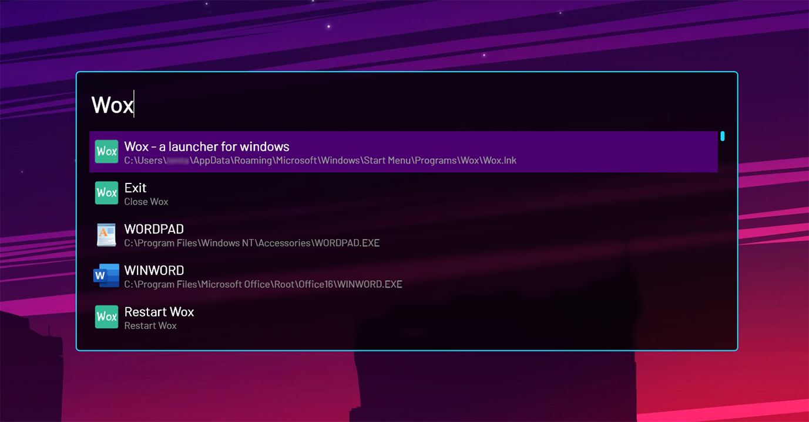

# HyperNight-Wox-Theme
A dark, translucent cyberpunk theme for Wox

### Installing  
1. Download [HyperNight](https://github.com/Cdddo/HyperNight-Wox-Theme/archive/master.zip)
2. Unzip
3. Move 'HyperNight.xaml' to the Wox themes directory, usually in `C:\Users\<your user name>\AppData\Local\Wox\app-1.3.xxx\Themes`

### Activating the Theme
1. Open Wox settings
2. Go to the Theme tab, then select `HyperNight`
